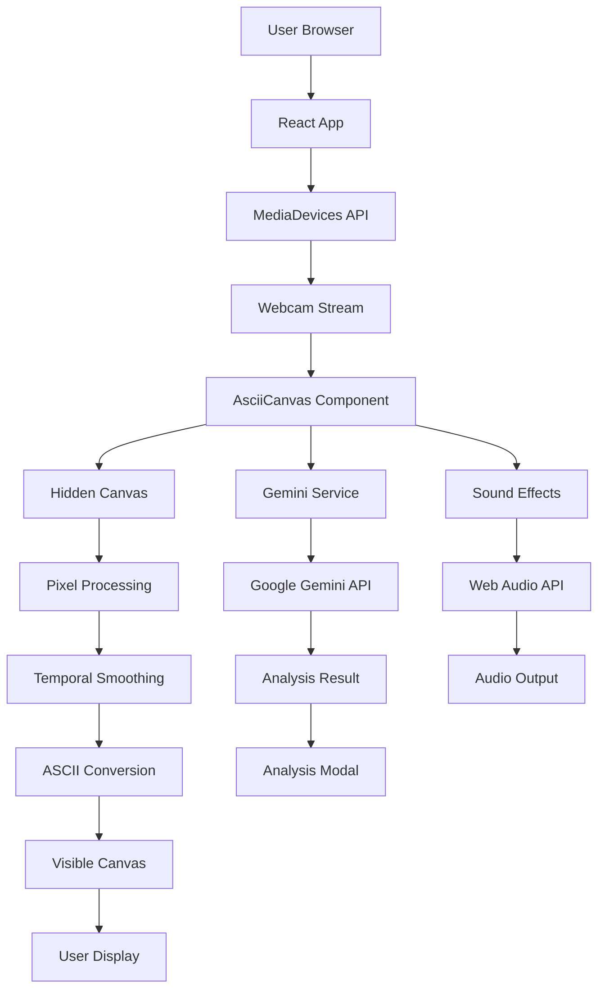
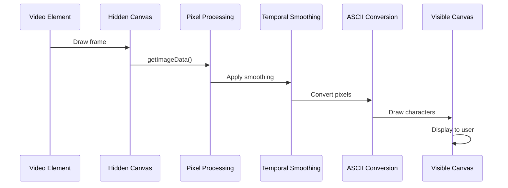
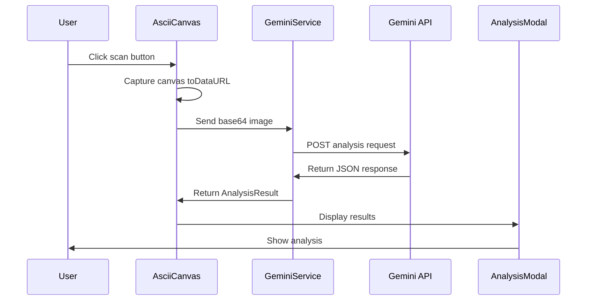

# Architecture

## High-Level Architecture

CyberAscii Vision is a client-side React application that processes webcam video in real-time and converts it to ASCII art. The application is entirely frontend-based with no backend server, making it lightweight and easy to deploy.



## Component Architecture

### Application Flow

1. **Initialization**: React app mounts and requests camera permissions
2. **Camera Access**: MediaDevices API captures webcam stream
3. **Frame Processing**: Video frames are processed in real-time
4. **ASCII Conversion**: Pixels are mapped to ASCII characters
5. **Rendering**: ASCII characters are drawn to canvas
6. **User Interaction**: Controls adjust visual parameters
7. **AI Analysis**: Captured frames are sent to Gemini API
8. **Audio Feedback**: Sound effects enhance user experience

### Component Hierarchy

```
App (Main Container)
├── Header (HUD Display)
├── AsciiCanvas (Main Visual Component)
│   ├── Video Element (Hidden source)
│   ├── Hidden Canvas (Processing)
│   └── Visible Canvas (Rendering)
├── ControlPanel (UI Controls)
└── AnalysisModal (AI Results)
```

## Major Components

### 1. App Component (`App.tsx`)

**Responsibilities**:
- Application state management
- Component orchestration
- Event handling for captures
- AI analysis coordination

**State Management**:
```typescript
- options: AsciiOptions (visual parameters)
- isAnalyzing: boolean (AI processing state)
- analysisResult: AnalysisResult | null (AI response)
- isModalOpen: boolean (modal visibility)
```

**Key Functions**:
- `handleCapture`: Initiates AI analysis of current frame
- Coordinates between AsciiCanvas and AnalysisModal

### 2. AsciiCanvas Component (`components/AsciiCanvas.tsx`)

**Responsibilities**:
- Camera access and stream management
- Real-time frame processing
- ASCII conversion and rendering
- Temporal smoothing for visual stability
- Screenshot functionality
- Audio integration

**Key Technologies**:
- MediaDevices API for camera access
- Canvas API for pixel manipulation
- requestAnimationFrame for smooth rendering
- Web Audio API for sound effects

**Processing Pipeline**:
1. Capture video frame to hidden canvas
2. Apply horizontal flip (mirror effect)
3. Extract pixel data using `getImageData`
4. Apply temporal smoothing (low-pass filter)
5. Convert pixels to ASCII characters
6. Render to visible canvas with styling

**Temporal Smoothing**:
- Uses 0.75 inertia factor for smooth transitions
- Blends current frame with previous frame
- Reduces ASCII character flickering
- Implements formula: `newValue = prev + (target - prev) * (1 - inertia)`

### 3. ControlPanel Component (`components/ControlPanel.tsx`)

**Responsibilities**:
- UI controls for visual parameters
- State updates for ASCII options
- Audio feedback for user interactions

**Controls**:
- Font Size (6-24px)
- Brightness/Gain (0.5-2.0)
- Contrast (0.5-3.0)
- Color Mode (matrix, bw, retro, color)
- Character Density (simple, complex, binary, blocks)

### 4. AnalysisModal Component (`components/AnalysisModal.tsx`)

**Responsibilities**:
- Display AI analysis results
- Loading state visualization
- Cyberpunk-themed presentation
- Error handling display

**States**:
- Loading: Shows scanning animation
- Success: Displays threat level, description, and tags
- Error: Shows error message

### 5. Gemini Service (`services/geminiService.ts`)

**Responsibilities**:
- Google Gemini API integration
- Image analysis requests
- Response parsing and error handling
- API key management

**API Configuration**:
- Model: `gemini-3-flash-preview`
- Input: Base64-encoded image
- Output: JSON with structured schema
- Theme: Cyberpunk security AI persona

## Data Flow

### ASCII Conversion Flow



### AI Analysis Flow



## Technology Stack

### Frontend Framework
- **React 19.2.4**: UI component library
- **TypeScript 5.8.2**: Type-safe JavaScript
- **Vite 6.2.0**: Build tool and dev server

### Styling
- **Tailwind CSS**: Utility-first CSS framework (via CDN)
- **Custom CSS**: Cyberpunk theme, scanlines, animations

### Graphics & Media
- **Canvas API**: Pixel manipulation and rendering
- **MediaDevices API**: Camera access
- **Web Audio API**: Sound effects generation

### AI Integration
- **@google/genai 1.40.0**: Google Gemini AI SDK
- **gemini-3-flash-preview**: AI model for image analysis

### Icons & Fonts
- **Lucide React**: Icon library
- **JetBrains Mono**: Monospace font for ASCII
- **Share Tech Mono**: UI font for cyberpunk theme

## Performance Optimizations

### Canvas Rendering
- **Dual Canvas Approach**: Hidden canvas for processing, visible canvas for rendering
- **Request Animation Frame**: Smooth 60fps rendering
- **Pixel Optimization**: Processing at reduced resolution based on font size

### Temporal Smoothing
- **Frame Buffering**: Stores previous frame for blending
- **Low-Pass Filter**: Reduces high-frequency changes
- **Configurable Inertia**: 0.75 factor for optimal smoothness

### Audio Management
- **Shared Context**: Single AudioContext instance
- **Efficient Oscillators**: Proper cleanup and disconnect
- **Gain Control**: Volume management for seamless experience

### Memory Management
- **Canvas Resizing**: Proper cleanup on resize
- **Stream Cleanup**: Camera track stopping on unmount
- **Audio Cleanup**: Oscillator and node disconnect

## State Management

The application uses React's built-in state management:

### Local Component State
- **App**: Global options, analysis state, modal visibility
- **AsciiCanvas**: Error state, animation frame references
- **ControlPanel**: Derived from parent props
- **AnalysisModal**: Display state only

### Props Flow
- **Top-down**: App passes options to child components
- **Event bubbling**: Child components notify parent of changes
- **Callback pattern**: Parent provides event handlers to children

## Security Architecture

### Client-Side Processing
- All video processing happens in the browser
- No video data is stored or transmitted except for AI analysis
- No persistent storage of camera feeds

### API Security
- API key stored in environment variables
- Never committed to version control
- Only base64 image data sent to external API

### Browser Security
- Requires HTTPS for camera access in production
- Camera permissions handled by browser security model
- No access to file system or system resources

## Browser Compatibility

### Required APIs
- **MediaDevices API**: Camera access
- **Canvas API**: Graphics rendering
- **Web Audio API**: Sound generation
- **requestAnimationFrame**: Smooth animation

### Browser Support
- **Chrome/Edge**: Full support (recommended)
- **Firefox**: Full support
- **Safari**: Full support (audio may require user interaction)
- **Mobile**: Limited support (camera permissions vary)

## Deployment Architecture

### Static Site Deployment
The application is designed for static site hosting:

- **Build Output**: Single `dist/` directory
- **No Server Requirements**: Can be hosted on any static file server
- **CDN Compatible**: All dependencies via CDN or bundled
- **Environment Variables**: Runtime configuration via build process

### Hosting Options
- Vercel, Netlify, GitHub Pages
- AWS S3 + CloudFront
- Any static web hosting service
- Local file system (for development)

## Known Architectural Limitations

1. **No Backend**: All processing is client-side
2. **No Database**: No persistent storage
3. **No Authentication**: No user system
4. **Single Session**: No multi-user support
5. **API Dependency**: Requires Gemini API for AI features
6. **Browser Constraints**: Limited by browser capabilities
7. **No Offline Support**: Requires internet for AI features

## Future Architectural Improvements

Potential architectural enhancements:

1. **Service Worker**: Add offline support
2. **IndexedDB**: Local storage for presets/saved analyses
3. **Web Workers**: Offload processing to background threads
4. **WebRTC**: Support for remote camera streams
5. **API Abstraction**: Support for multiple AI providers
6. **State Management**: Redux/Zustand for complex state
7. **Component Library**: Extract reusable UI components
